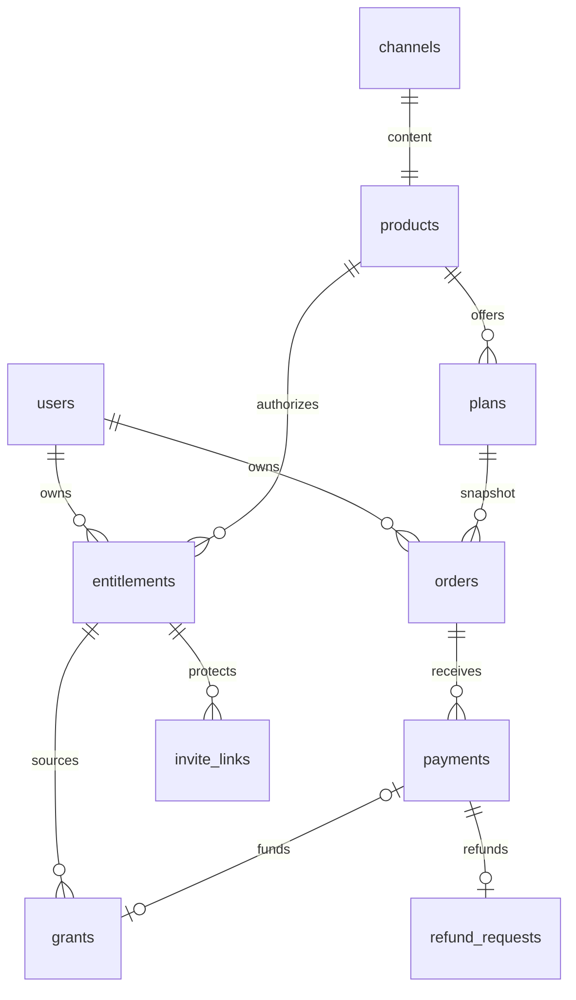

# Архитектура и инварианты

> Обновление 14.09.2026: новые покупки переведены на внутренний баланс без автопродления. Актуальная схема — [WALLET.md](WALLET.md). Описание прямых платежей/recurring ниже сохранено как история и контекст совместимости.

Все entity ID — UUID, Telegram ID — BIGINT, время — TIMESTAMPTZ/UTC. PostgreSQL строковые статусы защищены CHECK там, где объявлены; тарифные условия enforced в CHECK, а не только Pydantic. Используются отдельные products и plans. `products.channel_id` UNIQUE: один канал не делится между конфликтующими продуктами.

| Таблица | Назначение / ограничения |
|---|---|
| users | Минимальный Telegram profile, UNIQUE telegram_user_id |
| channels | Приватный Telegram chat, UNIQUE telegram_chat_id |
| products | Контент, обложка, visibility, сортировка; канал неизменяем |
| plans | Free/fixed/recurring_30d/lifetime, integer Stars, CHECK комбинаций |
| orders | UUID payload; snapshot цены, типа, длительности; UNIQUE request_key |
| payments | UNIQUE telegram_payment_charge_id, XTR, история recurring и refund |
| entitlements | UNIQUE (user_id, product_id), текущее право и removal_pending |
| grants | Основания доступа; UNIQUE payment_id и idempotency_key; возможность исключить вклад refund |
| invite_links | Entitlement + точный Telegram user/chat, срок, used/revoked |
| audit_logs | Кто/что/до/после, UNIQUE request_key; runtime не может обновлять/удалять |
| update_receipts | PK update_id, факт законченной обработки |
| refund_requests | UNIQUE payment_id, durable pending/done, счётчик попыток |
| payment_reversals | Refund events по charge ID, включая доставленные раньше successful_payment |

## Платёж

1. Callback содержит только UUID тарифа. Сервер читает текущий тариф и создаёт snapshot Order.
2. Pre-checkout берёт Order FOR UPDATE, проверяет пользователя и параметры. Entitlement не создаётся.
3. Successful payment берёт session advisory lock по user/product, затем короткую DB transaction и Order FOR UPDATE.
4. Повторный charge возвращает существующий результат; UNIQUE — дополнительная защита даже при ошибке application locking.
5. Payment, grant, entitlement и paid state фиксируются вместе. Network calls идут после commit.
6. Разовые дополнительные реальные charge для закрытого заказа сохраняются и направляются в durable refund queue, без нового grant.

Истечение invoice не уничтожает право обработать фактически состоявшееся успешное списание. Отключение тарифа после pre-checkout также не уничтожает оплаченные деньги. События с несовпадением владельца/валюты/суммы отвергаются и дают `update_rejected`; их необходимо расследовать по update_id через финансовый учёт, не логируя исходный payload.

## Сроки

Журнал grants воспроизводится в порядке created_at/id. Fixed: `max(purchase_time, previous_expiration) + duration`. Lifetime не сокращается следующей покупкой. Recurring использует максимальный подтверждённый period_end; доставка старого периода после нового не сокращает доступ. При сочетании разных оснований сохраняется уже оплаченный больший срок.

Refund исключает конкретный grant, затем пересчитывает агрегат. Отмена подписки изменяет только Order.subscription_state. Ручной отзыв инвалидирует предыдущие grants; новая покупка после него создаёт новое основание.

## Блокировки и сбои

Все изменения прав, approve, ban/unban и создание ссылок используют один ключ `access:<telegram_user_id>:<product_id>`. Он удерживается на отдельном PostgreSQL session connection, но без открытой долгой транзакции во время Telegram API. После процесса/соединения PostgreSQL освобождает lock. NullPool не возвращает соединение с потенциальной session lock другим операциям. Это требует direct connection/session pooling.

Операции Telegram и PostgreSQL не могут быть одной ACID-транзакцией. Поэтому используются проверка текущего состояния, durable flags, явная повторная обработка и reconciliation:

- После банирования неудачный unban оставляет removal_pending. Повторяет обе операции под тем же ключом.
- Перед удалением повторно проверяется entitlement: покупка, успевшая продлить его, предотвращает удаление.
- Использованная ссылка помечается used до revoke; cleanup повторяет revoke.
- При неизвестном результате approve проверяется membership, но только после проверки entitlement и владельца приглашения.
- Не сохранённая в БД ссылка не может пройти проверку join request; она ограничена TTL даже при падении между Telegram и commit.
- Refund request фиксируется до Telegram; потеря ответа повторяется по charge ID. Явный `CHARGE_ALREADY_REFUNDED` считается подтверждением уже выполненного refund.

Webhook receipt записывается после обработки. Падение до receipt допускает повтор transport-ответа или invoice; grants/orders/admin mutations отдельно идемпотентны. Это at-least-once доставка, не обещание exactly-once сообщений в Telegram. Receipt хранится в PostgreSQL без TTL: очистку исторических receipts следует добавлять отдельной миграцией/политикой с учётом повторов.

Redis обеспечивает только атомарные rate limits по user/operation через Lua INCR+EXPIRE. При его недоступности новые пользовательские операции ограничиваются отказом, платежные события продолжают защищаться PostgreSQL. IP-limit — только дополнительный барьер.

## Пределы

Нет распределённой транзакции с Telegram. При сетевом разделении возможна задержка отзыва до восстановления Telegram/worker; периодические задачи повторяют операции. Владелец канала может добавлять людей вручную. Telegram API не позволяет этому приложению перечислить всех участников для поиска произвольных ручных добавлений: reconciliation проверяет известные entitlement.

Refund events сохраняются отдельно по charge ID: последующая доставка уже возвращённой оплаты не создаёт grant. Raw updates не сохраняются целиком. Если Telegram прекратит повторную доставку до восстановления сервера, импорт пропущенных платежей требует отдельной финансовой сверки. Нужны мониторинг доступности и WAL/PITR, а не только ежедневный dump.
